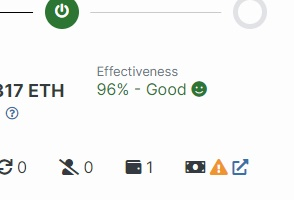

# ETH Validator Tutorials   for any native ETH2.0 validator

 

### **Section 1: Update your validator's withdrawal credentials to the new 0x01 format *(partial withdrawal)***

To change the withdrawal credentials on your validator from the old 0x00 credential style to the new 0x01 credential style, you need to sign a specific message with your validator's mnemonic, and publish that message to the network (aka “BLS-To-Execution-Change”). Doing this will allow for your accumulated validator rewards to be swept fee-free into your ETH wallet approximately every 7 days (called a partial withdrawal), and also allow for you to exit your validator in the future (called a full withdrawal).

If you do not update your withdrawal credentials, some of your validator rewards (all except block proposal rewards) will just accumulate within the validator instead of being sent to you, and you will not be able to exit the validator and reclaim your 32ETH stake in the future until this process is completed. If you are unsure of the status of your withdrawal credentials, you can check your validator’s public dashboard on [Beaconcha.in](https://beaconcha.in/), and look for a yellow error icon next to the withdrawals icon, which indicates the withdrawal credentials have not been updated.

> 

Due to the finality of only being allowed to update your withdrawal credentials once, this process improves the safety of your staked ETH, if your validator private keys ever become compromised. But for this very reason, you also need to be careful when you choose an ETH wallet address to designate, as this process permanently locks your entire stake to that wallet address. As this change can only be published to the network once, you must ensure that the wallet address you designate for the deposit of your rewards, is an address you own and have the keys to, and will continue to own and control. Otherwise your rewards and entire ETH stake will be unrecoverable in the future. Using a crypto exchange deposit address is NOT recommended, as they can change/expire, and you don’t own the keys to those addresses.

The following tutorials have step-by-step instructions on how to update your withdrawal credentials using your choice of tool:

👉 **1a:** [Using the Wagyu Key Gen tool](Tutorials/Update_Withdrawal_Credentials_with_Wagyu.md) *(GUI)*
 — or — 
👉 **1b:** [Using the Staking-Deposit-CLI tool](Tutorials/Update_Withdrawal_Credentials_with_CLI.md) *(CLI)*

 

### **Section 2: Restoring/recreating your keystore files for future use *(optional)***

A keystore file is a JSON text file that you may have created when you created your validator in the beginning. This file contains select information derived from your validator's mnemonic, and contain your validator’s basic info and its private signing key, and the file is encrypted with a password you chose. These files do not have your withdrawal key, so they are safer to use than mnemonics. These keystore files can be used to import your validator onto any hosting service without exposing your withdrawal keys. These files can also be used to sign messages for the validator, such as an exit message, again, without having to use the mnemonic.

The following tutorials have step-by-step instructions on how to recreate keystore files for your validator using your choice of tool:

👉 **2a:** [Using the Wagyu Key Gen tool](Tutorials/Recreate_Keystore_Files_with_Wagyu.md) *(GUI)*
 — or — 
👉 **2b:** [Using the Staking-Deposit-CLI tool](Tutorials/Recreate_Keystore_Files_with_CLI.md) *(CLI)*

 

### **Section 3: Exit Your Validator *(full withdrawal)***

To exit your mainnet validator and have your ETH stake returned to you, you must sign a specific exit message and publish it to the network. If you have not yet locked your validator to a specific ETH wallet by updating your withdrawal credentials to the new 0x01 format, you will need to do so first before your validator is eligible for exiting (see Section 1 above for updating withdrawal credentials). To sign an exit message, you need to use tool called Ethdo. As far as I have been able to test it, this tool will only work with mainnet validators, not testnet validators. This tool is a command line interface, not a GUI. At present, I don’t know of a good GUI for exiting validators, that I can trust and recommend.

The following tutorials have step-by-step instructions on how to sign and publish an exit message for your validator using Ethdo and your choice of input method:

👉 **3a:** [Using the Ethdo tool with validator keystore files](Tutorials/Exit_Validator_with_Keystore_File.md) *(CLI)*
 — or — 
👉 **3b:** [Using the Ethdo tool with validator mnemonic (batching option available)](Tutorials/Exit_Validator_with_Validator_Mnemonic.md) *(CLI)*

 

### **Section 4: Understanding Validator Position Indexes**

A validator is an entity created/defined by and derived from a private key, which is commonly represented by a 24-word mnemonic (seed words). So how is it possible to have more than one independent validator derived from the same set of seed words? There is another piece of information that further defines any specific validator and differentiates it from the rest of the validators under that same mnemonic. This additional information is the position index value. Depending on how you set up your validators originally, you will need to understand this concept in order to complete the withdrawal credential update process in the Section 1 tutorials (which have links to this guide in some steps).

The following tutorial has an in-depth explanation of how position indexes work:

👉 [In depth: Understanding Validator Position Indexes](Tutorials/Understanding_Validator_Position_Indexes.md)

 

***

*Like these tutorials?* 
*Tips are appreciated, but never expected.* 
*ETH / USDC / ERC20 Tokens:* 0xc1B5d712DB2e56a3201116c326186193b3ADb948 

