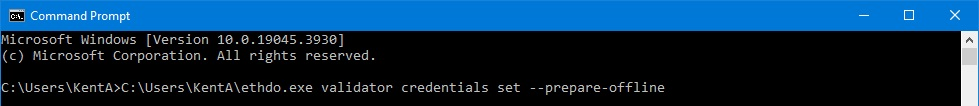
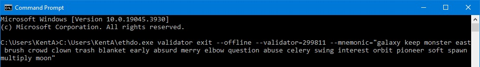
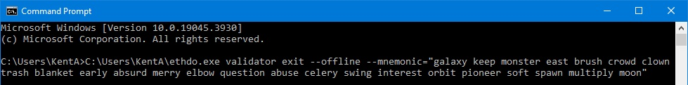

# Exit your Validator (full withdrawal) — using the command line interface Ethdo — with only your validator's mnemonic seed words

To exit your mainnet validator and have your ETH stake returned to you, you must sign a specific message and publish it to the network. If you have not updated your withdrawal credentials to the new 0x01 format, you will need to do so first before your validator is eligible for exiting (see the Section 1 [tutorials](/../main/README.md)). I've only tested the Ethdo tool on mainnet validators, so this tutorial may not be accurate for signing for testnet validators. This tool is a command line interface, not a GUI. At present, I don't know of a good GUI for exiting validators, that I can trust and recommend.

Before you start, you should collect the following info somewhere handy, so you can do this process offline for best security:

|       | Worksheet Data: |
| ---   | :--- |
| **A** | The 24-word mnemonic for your validator. |
| **B** | <i>If you are signing an exit message for all validators under this mnemonic, you can skip this part as you won't need the validator's ID info.</i> Choose either one of the following info (if you don't know these already, you can browse to your validator's public dashboard on [beaconcha.in](https://mainnet.beaconcha.in) to locate this info). You only need one:  -- The validator index number (1-7 digit unique identifier for every validator). or -- The validator public key (long string under the validator index number).  |

 

1. Browse to [https://github.com](https://github.com) and find the “wealdtech/ethdo” program, and click on “releases” on the right side of the page. The most recent release is at the top. Or navigate to [https://github.com/wealdtech/ethdo/releases](https://github.com/wealdtech/ethdo/releases). Although there are newer versions of the software available, I have only tested versions as new as “Release 1.31.0” (first version with the feature of allowing the user to sign a batch of exit messages all at once), and I have heard many reports from users that the newer versions give unexpected errors when prompted with the below commands. If you would like to read more technical details on the various commands you can use Ethdo with, the source documents specifically related to exiting validators, are here: [https://github.com/wealdtech/ethdo/blob/master/docs/exitingvalidators.md](https://github.com/wealdtech/ethdo/blob/master/docs/exitingvalidators.md).
2. Scroll down to “Assets” and download the version appropriate to your system. This tutorial is written only for Windows systems, so choose the file that ends with “.zip”.
3. In Explorer, locate the compressed zip file you just downloaded, and extract the contents. To easily extract compressed files in Windows, right click on the file and select <code>Extract All...</code>.
4. Within the new folder you just extracted the files to, navigate in until you find the “ethdo.exe” file, and move that file to any folder of your choice that has a short path that has no spaces in it. You will need to type this path a couple times later, so if it's shorter, your task will be easier.
5. For the next step, you need to be online briefly so the program can download an offline version of a public validator data list, for it to use later. You can skip them if you have already completed steps 5-9.
6. From your start menu, run your Command Prompt app. (Windows PowerShell app works just as well, and has color-coding to make commands easier to read)
7. Type or copy/paste the following command, changing the <code>[FolderPath]</code> to wherever you put that ethdo.exe file, and then press enter: <code>[FolderPath]\ethdo.exe validator credentials set --prepare-offline</code> For example: 
8. You will see the following message response: <code>No connection supplied with --connection parameter and no local beacon node found, attempting to use mainnet fallback</code>. It is first attempting to contact your local node, and since you likely are not running a node on your computer, it will automatically switch to accessing the data it needs from the internet using the “mainnet fallback” option. Be patient and wait until it completes and displays this message: <code>offline-preparation.json generated</code>. This may be up to a couple minutes long depending on your internet download speed. It has now downloaded and saved to your harddrive a ~250MB+ JSON database file that contains public data on every validator on the network. It will use this data next, to get certain details of your validator so it can sign the appropriate exit message for you. Do NOT move this file from its current location, or else the following steps will not work as the program won't be able to find it. If you need to move this file between online/offline computers, just make sure this file is placed in whatever folder is the normal Windows Users folder of that computer and the user logged into it. For example, <code>C:\\Users\\KentA\\</code>. (Note: If in doubt, you can identify the Windows Users folder for your machine, by opening a File Explorer window and typing <code>%userprofile%</code> in the box)
9. When the download has completed, for good security practices, you should now disconnect your computer from the internet or turn off your WiFi. Even better, move the program (a single executable file) to an air-gapped computer for the sensitive operations with your mnemonic seed words. If switching computers, you will need to also move the database JSON file created in step 8, and ensure it is located in the correct folder, as described in step 8.
10. If you wish to sign an exit message for all validators under your mnemonic, skip to step 11. If you wish to sign an exit message for a single specific validator, type or copy/paste the command highlighted below, using the following changes, and then go to step 12: <i>(Tip: you might find it helpful to prepare this command in a text editor, make the needed changes to customize it, and then copy the final result to the command prompt app)</i>
    * Change <code>[FolderPath]</code> to wherever you put the ethdo.exe file.
    * Change <code>[ValidatorIndex]</code> to the public validator index or public key. (Worksheet Data #B)
    * Change <code>[MnemonicWords]</code> to the mnemonic seed words for your validator. (Worksheet Data #A) <code>[FolderPath]\ethdo.exe validator exit --offline --validator=[ValidatorIndex] --mnemonic="[MnemonicWords]"</code> For example:  or: 
11. If you skipped step 10, type or copy/paste the command highlighted below, using the following changes: <i>(Tip: you might find it helpful to prepare this command in a text editor, make the needed changes to customize it, and then copy the final result to the command prompt app)</i>
    * Change <code>[FolderPath]</code> to wherever you put the ethdo.exe file.
    * Change <code>[MnemonicWords]</code> to the mnemonic seed words for your validator. (Worksheet Data #A) <code>[FolderPath]\ethdo.exe validator exit --offline --mnemonic="[MnemonicWords]"</code> For example: 
12. When it completes (<5 seconds usually), you will find a new “exit-operation.json” file created in your personal Windows Users folder (see note in step 8 above). You can now close the app.
13. Go back online (or move the newly-created “exit-operation.json” file to your online computer) and navigate to [https://mainnet.beaconcha.in/tools/broadcast](https://mainnet.beaconcha.in/tools/broadcast). (mainnet validators only)
14. Upload the “exit-operation.json” file that you just had created, verify that the data in the message corresponds to the validator you wish to exit, and click <code>Submit & Broadcast</code>.
15. The signed exit instruction will now be sent out to a network node. The update should be finalized on the network within 10 minutes.
16. When broadcasted and accepted by a node, you will see your validator move into “Exited” status on your [beaconcha.in](https://beaconcha.in/) validator dashboard page, along with dates and times on the right side of the page showing when your validator is estimated to be next in the exit queue. Exit queues can often be a few days long, so keep your validator running and validating and earning rewards, until your dashboard shows your validator has had its turn to fully exit. Once exited, the validator enters a pause period of about a day, and after that, it gets marked as withdrawable. Your entire stake and any earned rewards not swept out before, will be swept into your wallet when the sweeper is scheduled to come around to this validator next after the withdrawable date.
17. Remember that large database file the program made? If you're done signing validator exit messages, you can delete it now, since you're done with it, and it uses a lot of disk space. It's located in the same folder you found the “exit-operation.json” file, and is called “offline-preparation.json”.

 

[Back to Home](/../main/README.md)
