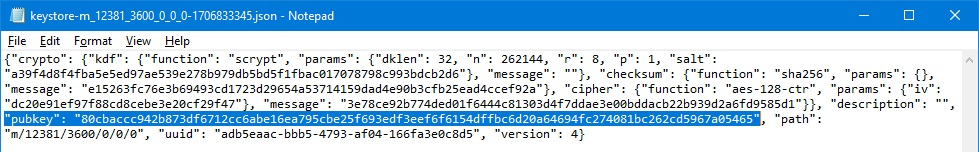

# Restoring/Recreating your Keystore Files — with Wagyu Key Gen

A keystore file is a JSON text file that you may have created when you created your validator in the beginning. This file contains your validator's basic info and its private key, and the file is encrypted with a password you chose. The following process will help you restore/recreate that keystore file. If you have already completed the section in this tutorial for updating your validator withdrawal credentials with Wagyu Key Gen, you already have the needed software downloaded, and you can skip steps 1-2 below.
Before you start, you should have handy, your 24-word mnemonic (seed phrase) for your validator.

1. Browse to [https://github.com](https://github.com) and find the “stake-house/wagyu-key-gen” program, and click on “releases“ on the right side of the page. The last release I tested for this tutorial is titled “Version 1.7.0”, but newer releases should also work. Or navigate to [https://github.com/stake-house/wagyu-key-gen/releases/](https://github.com/stake-house/wagyu-key-gen/releases/).
2. Scroll down to “Assets” and download the version appropriate to your system. This tutorial is written only for Windows systems, so choose the file that ends with “.exe”. This is a single exe file stand-alone application, so there is no install process.
3. If you're on an online system, for good security practices, you should now disconnect your computer from the internet or turn off your WiFi. Even better, move the program (single executable file) to an air-gapped computer for the sensitive operations with your mnemonic seed words.
4. Locate and run the newly downloaded Wagyu Key Gen program. You can also type “Wagyu Key Gen” in your Start menu to find it.
5. Click <code>USE EXISTING SECRET RECOVERY PHRASE</code>.
6. Select your network, and click <code>OK</code>.
7. Click <code>REGENERATE YOUR VALIDATOR KEYS</code>.
8. Type the 24-word mnemonic for your validator, and click <code>IMPORT</code>.
9. Fill in the boxes with the following information:
    * <code>[Number of New Keys]</code> – Enter the total number of validators you have previously created under the same mnemonic you entered above (including validators you created but never deposited to). This will define the size of the set of validators you want to recreate the keystore files for. Separate keystore files will be created for each validator located in the range defined by this box and the next box.
    * <code>[Amount of Existing - starting index]</code> – Enter the zero-based position index number of the first validator in the set that you wish to recreate keystore files for. If you only created one validator with the above mnemonic (including validators you created but never deposited to), enter 0 for the first validator in the set, and 1 in the previous box. Keystore files will be sequentially recreated, starting first with the validator position index value entered here, and encompassing a sequential range of validators as large as the number entered in the previous box. For example, if you choose 2 here for the starting validator position index, and you chose 3 in the previous box for the total number of validators, three keystore files will be created for validators with position indexes 2, 3, and 4, and validators with position indexes 0 and 1 will be skipped. See the Section 4 tutorial on position indexes [here](Understanding_Validator_Position_Indexes.md).
    * <code>[Password]</code> – Create and enter a password of your choice (minimum 8 characters). This password will only be used to encrypt the keystore file on your computer, and has no effect on the validator itself or the network.
    * <code>[Ethereum Withdrawal Address]</code> – Since we are recreating keystore files for existing validators, skip this optional box, and leave it blank.
10. Click <code>NEXT</code>.
11. Retype the same password again, to confirm it, and click <code>NEXT</code>.
12. Choose a folder to save your signed message, and click <code>CREATE</code>.
13. The page will show a summary of the files just created, and you can now close the program. Sensitive tasks are complete, so you no longer need to be offline anymore.
14. The program has now created your encrypted keystore JSON files (one file for each validator) and saved them where you directed, using the filename format <code>keystore-m_12381_3600_**X**_x_x-xxxxxxxxxx.json</code>, where the bold **X** in this filename example is the validator position index of the specific validator whose info is contained inside that file.
16. <i>(optional step, but recommended)</i> To verify that you created a valid keystore file as expected that has the correct validator info in it, open each file in a text editor (i.e. right-click > Open With > Notepad), and check the “pubkey" field and make sure it matches the public key of the corresponding validator (the “0x” prefix is sometimes truncated). A public key for any validator is displayed in any dashboard, or on the public [beaconcha.in](https://beaconcha.in/) validator dashboard page for your validator.

  

 

[Back to Home](/../main/README.md)
