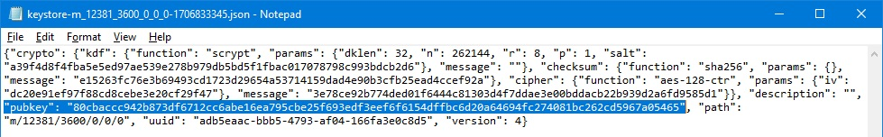

# Validator Position Indexes — what are they?

A validator is an entity created/defined by and derived from a private key, which is commonly represented by a 24-word mnemonic (seed words). So how is it possible to have more than one independent validator derived from the same set of seed words? There is another piece of information that further defines any specific validator and differentiates it from the rest of the validators under that same mnemonic. This additional information is the position index value.

A mnemonic can be used to derive an infinite number of validators, and each one of those validators has a unique validator position index that defines it. These position indexes are zero-based, so the first possible validator under any mnemonic is position index 0.

When you set up your validator, you create (or were assigned) a random mnemonic. Some software gives you the option to pick your own validator from the infinite set of validator keys within that mnemonic, but most softwares choose for you. When they choose for you, it is standard practice for it to start with the first index 0, and give you the validator for that index. If you are creating more than one validator under the same mnemonic, it will then give you your second validator with a position index 1, and then your third validator with a position index 2, and so on for as long as you want more unique validators under this mnemonic. Even if you never deposit into a given validator, that validator still has a unique position index, and the next validator you request in the set will have the next position index. In this way, you may end up with active and inactive validators in any sequential range of position indexes.

Here is an example set of validators to help explain the next part:

| What I think I have:               | Actual Validator Position Index: | Validator Public Index: | BLS Withdrawal Credentials (abbreviated for example): |
| :---                               | :---:                               | :---:                   | :---:                                                    |
| My “first” validator, index 0      | 0                                   | 299811                  | 0x00345c41e18d                                           |
| I didn't deposit to this validator | 1                                   | Never got assigned      | 0x0025648f370a                                           |
| I didn't deposit to this validator | 2                                   | Never got assigned      | 0x002b984a8932                                           |
| My “second” validator, index 1     | 3                                   | 351804                  | 0x00cc3a8825e8                                           |
| My “third” validator, index 2      | 4                                   | 314543                  | 0x004b5e2f8f339                                          |

If you created 5 sequentially-indexed validators, deposit into the first, fourth, and fifth validator, and skip the second and third validator, you might think you only have three validators and they are index positions 0, 1, and 2. But their position indexes do not change after they are created, even if you don't end up depositing to them. So in this example, you would still have the following:
- Validator Position Index 0 (active - deposit assigned to Validator Public Index 299811)
- Validator Position Index 1 (inactive - no deposit, so not assigned any Validator Public Index)
- Validator Position Index 2 (inactive - no deposit, so not assigned any Validator Public Index)
- Validator Position Index 3 (active - deposit assigned to Validator Public Index 351804)
- Validator Position Index 4 (active - deposit assigned to Validator Public Index 314543).

This becomes critical to understand later when you want to sign messages for specific validators, as you have to use the correct index for any given validator, no matter whether you deposited to it or not. In our example, if you try to sign a message for what you understand is your “third” active validator (actually your fifth validator in the full set), give the correct mnemonic, give the correct public ID (314543) and other info for that “third” active validator, but give the wrong position index (position index 2 instead of the correct position index 4), the process will fail. It will fail because the pieces of correct info given to the tool for the “third” active validator does not match the keys the tool derives from the combination of the mnemonic and the validator position index 2 that you provided it (which belong to an inactive validator in this example). The info given to the tool matches the validator in the position index 4, but the tool can't know that's what was incorrectly entered, since you told it to look in position index 2 instead. The software can't know what went wrong, it just knows stuff doesn't match up. And when it extracts the keys from the info you provide, the keys don't work, since they are for a different validator.

When signing for a validator, softwares will commonly ask for information that defines a range of validators, or a set. They will ask for a starting index and a number of validators. What this means is it will sign messages as requested, for the validators within that set, starting with the value provided for the start index, and sequentially sign individual messages for each validator in the set, incrementing 1 each time until it has signed the total number of messages requested. So, for example, if I tell it I want it to start at index 3, and sign for the next 2 validators, it will sign for the validators that exist in position indexes 3 and 4. It will skip validators that exist in position indexes 0, 1, and 2, since they are outside of the range requested. Remember, this is all a zero-based index system, so 0 represents the first position.

 

### **Validator position indexes when signing BLS-Execution messages:**
In order to sign the same withdrawal credential update message for multiple different validators in a set (batching the job), the set has to be sequential and without gaps. In the previous example, I could do a batch job to sign for validators in position indexes 3 and 4, by telling the tool to use a start index of 3, and tell it to sign a total of 2 validators. This can be called an “index range”, a range of size 2 and start position 3. As long as the other info provided to the tool is entered (comma separated) in the same matching sequential order as their corresponding position indexes (as defined by the “index range” provided), everything will come out right without errors, with 2 separate signed message JSON files for validators 351804 and 314543. This example below will work correctly:

|                                          |                                             |
| ---:                                     | ---                                         |
| **Start Index:**                         | <code>3</code>                              |
| **Number of Validators:**                | <code>2</code>                              |
| **Public Validator Indexes (listed):**   | <code>351804,314543</code>                  |
| **BLS Withdrawal Credentials (listed):** | <code>0x00cc3a8825e8,0x004b5e2f8f339</code> |

But I can't sign for all three of our active validators in one batch, because they are not sequential without gaps. There's two validators (position indexes 1 and 2) that can't be signed for since they were never deposited or assigned a public validator ID. This breaks up the set, and requires the three validators to be processed in two separate batches (a one validator batch, and a two validator batch, respectively). Even though we tell the tool we have three validators, and provide three of everything required, this example will fail, since the info provided does not line up with the validators in the provided range of position indexes 0, 1, 2:

|                                          |                                                            |
| ---:                                     | ---                                                        |
| **Start Index:**                         | <code>0</code>                                             |
| **Number of Validators:**                | <code>3</code>                                             |
| **Public Validator Indexes (listed):**   | <code>299811,351804,314543</code>                          |
| **BLS Withdrawal Credentials (listed):** | <code>0x00345c41e18d,0x00cc3a8825e8,0x004b5e2f8f339</code> |

 

### Validator position indexes when recreating keystore files:
Unlike signing withdrawal credential update messages, creating keystore files is a little more straightforward. Since there is no difference between a keystore file for a validator that has been deposited to (active), and a validator that has not been deposited to (inactive), we do not need to be concerned about gaps in the sequences. We can tell the tool to create keystore files for all five of our validators, and if we want to, we can afterwards just discard the files we don't want (for example, the inactive validators at position indexes 1 and 2). To create all the keystores, we simply tell the tool to use start index 0, and 5 total validators. This will give us the five keystore files for position indexes 0, 1, 2, 3, and 4.

If you're not sure what your position indexes are, one easy way to find them all out, is to create a larger range of keystore files, and then look inside each file to compare the “pubkey” field to the validator public keys for all of your active validators. If it matches one of the validators, you now know which validator position index is connected to that particular validator, and can record that info in your personal records for future use. If the “pubkey” field does not match any of your validators, you can discard the file.

For example, if you <mark>created three validators</mark>, but also discarded a few in the process, and don't remember how it all went, you might search for your three validators in the range of 0 to 9. If you tell the tool to create ten total keystore files and start at position index 0, you will get ten validator keystore files for position indexes 0, 1, 2, 3, 4, 5, 6, 7, 8, and 9. In the previous examples, you would discover that the files for position indexes 0, 3, and 4 would match your active validators, and the other seven files can be discarded, as they don't have any matching info (they are all inactive validators never used).

Keystore files are typically named with the following filename format or something similar: <code>keystore-m_12381_3600_**X**_x_x-xxxxxxxxxx.json</code>, where the bold **X** in this filename example is the validator position index of the specific validator whose info is contained inside that file. Keystore files are JSON files and are just text files, and inside they look like this: 
