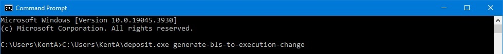

# Update your Validator's Withdrawal Credentials — with Staking-Deposit-CLI

Before you start, you should collect the following info somewhere handy, so you can do this process offline for best security. For items C and D, browse to [https://mainnet.beaconcha.in](https://mainnet.beaconcha.in) (if your validator is on a testnet, use the appropriate site for your validator) and locate your public validator dashboard for each validator in your set.

|       | Worksheet Data: |
| ---   | :--- |
| **A** | The 24-word mnemonic for your validator, or set of validators. |
| **B** | The ETH wallet address you want your validator rewards to be sent to during the network sweep that occurs approximately every 7 days, and also where you want your 32ETH stake to be sent to when you exit the validator in the future. This can be any ETH wallet address in a wallet you control and have the keys to. |
| **C** | For each validator, the validator's public index ID (1-7 digit unique identifier for every validator, at the top of the dashboard)  |
| **D** | For each validator, the old BLS withdrawal credentials of the validator. Look for the Deposits tab, click the copy button for the 0x00-style credentials under the “Withdrawal Cred.” column as shown, and paste it on your worksheet.  |
| **E** | (not on any website) For each validator, you will need the unique validator position index which matches the above collected info. If you created more than one validator with the above mnemonic (including validators created but not deposited to), see the Section 4 tutorial on position indexes [here](Understanding_Validator_Position_Indexes.md). Otherwise, your validator position index is likely 0 by default, the first validator in any set. |

 

1. Browse to [https://github.com](https://github.com) and find the “ethereum/staking-deposit-cli” program, and click on “releases“ on the right side of the page. The last release I tested for this tutorial is v2.5.0, titled “BTEC in the specs, check”. Or navigate to [https://github.com/ethereum/staking-deposit-cli/releases](https://github.com/ethereum/staking-deposit-cli/releases).
2. Scroll down to “Assets” and download the version appropriate to your system. For Windows systems, choose the file that ends with “.zip”.
3. In Explorer, locate the compressed zip file you just downloaded, and extract the contents. To easily extract compressed files in Windows, right click on the file and select <code>Extract All...</code>.
4. Within the new folder you just extracted the files to, navigate in until you find the “deposit.exe” file, and move that file to any folder of your choice that has a short path that has no spaces in it. You will need to type this path later, so if it's shorter, your task will be easier.
5. If you're on an online system, for good security practices, you should now disconnect your computer from the internet or turn off your WiFi. Even better, move the program (single executable file) to an air-gapped computer for the sensitive operations with your mnemonic seed words.
6. From your start menu, run your Command Prompt app. (Windows PowerShell app works just as well)
7. Type or copy/paste the following command changing the <code>[FolderPath]</code> to wherever you put that deposit.exe file, and then press enter: <code>[FolderPath]\deposit.exe generate-bls-to-execution-change</code> For example: 
8. Follow the prompts, pressing enter after each:
    * Type the number for your preferred language, or press enter for the default option.
    * Press enter for the mainnet. If your validator is on a testnet, choose the correct network name.
    * Enter the 24-word mnemonic for your validator. (Worksheet Data #A)
    * Enter the validator position index of the validator, or of the first validator if you have a set (Worksheet Data #E). If you created more than one validator with the above mnemonic (including validators created but not deposited to), see the Section 4 tutorial on position indexes [here](Understanding_Validator_Position_Indexes.md).
    * Enter the 1-6 digit validator public index ID as identified on the public blockchain (Worksheet Data #C). If you are signing for a batch of more than one validator all at once (must be consecutive without gaps), list their respective validator public index ID's in the same ascending order as their position indexes, separated by commas.
    * Enter the old BLS withdrawal credentials that your validator currently has (Worksheet Data #D). If you are signing for a batch of more than one validator all at once (must be consecutive without gaps), list their respective old BLS withdrawal credentials in the same ascending order as their position indexes, separated by commas.
    * Enter the ETH address you want your validator rewards to be sent to in the future. This is any ETH address in a wallet you own (Worksheet Data #B). If you are signing for a batch of more than one validator all at once, this address will be locked to all of the validators being signed for.
    * To confirm, reenter the ETH address for your wallet, to update the validator withdrawal credentials to (Worksheet Data #B).
> [!CAUTION]
> *As this step is critical and can only be done once, make sure this ETH wallet address is one you have the keys to and have full control of. This address can NOT be changed more than once during the life of your validator. This will permanently lock the withdrawal address of your validator to this wallet address, and your rewards and your entire 32ETH stake will go there in the future when your validator exits. <ins>Do not lose control of this wallet address in the future!!</ins>*
9. If successful, you will see the following response: <code>Success! Your SignedBLSToExecutionChange JSON file can be found at: [FolderPath]</code>
10. Take note of the location where it stored that JSON file, which should be your Windows Users folder.  (Note: If in doubt, you can identify the Windows Users folder for your machine, by opening a File Explorer window and typing <code>%userprofile%</code> in the box)
11. Go back online (or copy the resulting JSON file to your online computer) and navigate to [https://mainnet.beaconcha.in/tools/broadcast](https://mainnet.beaconcha.in/tools/broadcast). (if your signed message is for a testnet, navigate to a site that will publish testnet messages instead)
12. Check the file contents for accurancy, and then upload the JSON text file that you just had created, and click <code>Submit & Broadcast</code>. You can also copy and paste the text contents of the file instead. This file will have a name like: <code>“bls_to_execution_change-xxxxxxxxxx.json”</code>
13. The signed withdrawal credential update instruction will now be sent out to a network node. The update should be finalized on the network within 10 minutes. You can check the Deposits tab of your beaconcha.in validator dashboard page to see the change go into effect. 

 

[Back to Home](/../main/README.md)
